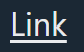
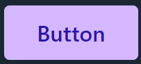
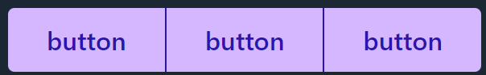

# Contexts

## Theme Context

Theme Context provides the ability to toggle between themes saved in local storage and adjust some app-wide settings:  
`inputsRadius`  
Radius for buttons and inputs.  
`transitions`  
Ability to disable all animated transitions in the app.  
`scalingButtons`  
Choose if buttons will scale down on press.  
`buttonsRetainFocus`  
If buttons like the outline button should remain their solid hover state during focus.

## DarkModeContext

The dark mode context reads and updates the dark theme prefernce of the user. It is required to use the Dark Mode Switcher and Toggle. It keeps the data in one place, so the buttons are in sync. It is included by default in the Theme Context, but can be used separately.

# Components

A collection of react components for personal use.

## Anchor

[Anchor](components/Anchor/Anchor.md)

## Button

A simple button: [Button](components/Button/Button.md)

## Button Group

Group buttons together: [Button Group](components/Button/ButtonGroup.md)

## Dark Mode Toggle

 

A toggle for switching between light, dark and system preferred mode: [Dark Mode Toggle](components/DarkModeToggle/DarkModeToggle.md)

## Hamburger Button

[Hamburger Button](components/HamburgerButton/HamburgerButton.md)

## Navbar

[Navbar](components/Navbar/Navbar.md)
