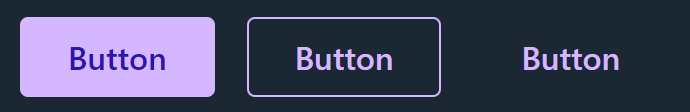
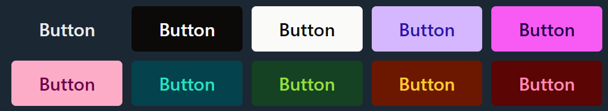
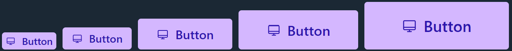

# Button

  

Buttons have the following properties:

`variant`

There are 3 available variants: `solid`, `outline` and `ghost`. Default one is solid.

</img>
  

`ghostHover`

In case a ghost variant is selected, use this prop to choose what the hover effect should be. 4 options: `none`, `fill`, `outline` and `contrasting`.

`radius`

Select between 3 variants: `small`, `full` and `none`. If none is selected, it will follow the theme, if there's one provided, or defaults to `small`.

`color`

There are 10 available colors. Read more about colors and customization here:

  

`size`

Five available sizes: `xs`, `sm`, `md`, `lg` and `xl`. They are responsive too.

  

`retainFocusState`

If this is `true` the outline and ghost button will retain their focused event on `focus:`. Otherwise they lose it as soon as the mouse leaves.

`disabled`

Disables the button and applies `disabled:` styles.

`selected`

Applies `selected:` styles. Can be used to indicated selected option in a button group.

`scaling`

Set to `false` to remove the scaling animation on button press.

`transitions`

Set to false to remove animated transitions between colors and scaling.

`loading`

Disables the button and adds a loading spinner. If an icon is provided with the `startIcon` or `endIcon` prop, that icon will be replaced by the spinner.

  

`loadingPosition`

Indicates if the loading spinner should appear at`start` or `end`.

`startIcon`

Adds an icon before the text.

`endIcon`

Adds an icon after the text.

`wrapperClasses`

The button has a `div` wrapper, used to display the not allowed cursor when the button is disabled. Use this if you want to apply any additional classes to this wrapper.

`as`

If the button should render as another component, an anchor for example.
