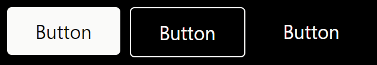
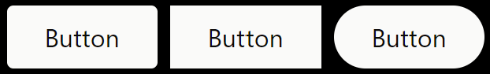
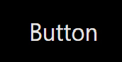
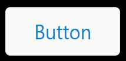
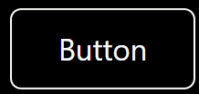
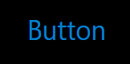
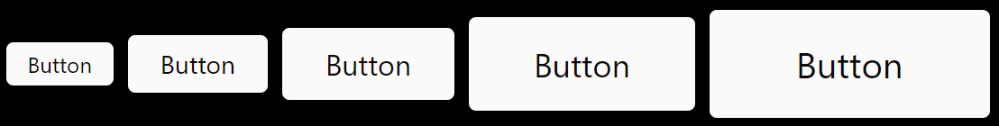
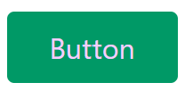
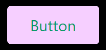
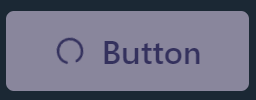

# Button

A basic button. It has the following properties:

`variant`

Choose which button variant you want. There are 3 available variants: solid, outline and clear. Default is solid.

`radius`

The corner radius of the button. There are 3 options: default, pill and rect. Default has a small radius, pill has a full radius and rect has sharp corners.

`clearButtonHover`

Used to select the hover effect on a clear button. It can be: none, outline, fill or contrasting. None will just make the text color darker (or lighter in dark mode), outline will add a border, fill will make it look like a solid button and contrasting will change the text color to the secondary color.

`size`

5 available sizes: xs, sm, md, lg and xl, md being the default.

`primaryColor`  
The primary color of the button, used for the background of the solid button or the text and outline for the other button variant.

`secondaryColor`  
Secondary color for the button. In the solid button variant this is used for the text color. In the other variants, it's used as the text color while hovering.

`disabled`  
If the button should be disabled or not.

`disableHoverHighlight`  
Disables color changes on hover and press to allow for customization.

`disableScale`  
Disables scale animations for hover and press.

`disableDisabledStyle`  
Disables disabled styling to allow for custom colors.

`contrasting`

If this is `true` (default behaviour), button colors will change from primary to secondary in dark mode. Primary color uses a dark shade and secondry color uses a light shade, so even the same color can be selected.

`loading`

Setting this to true will add a loading spinner in the button and disable it.

`loadingPosition`  
If the loading spinner should be in the front or the end of the button.

`icon`  
Adds the selected icon in the front of the button. You can put an icon in the children, but if you use this, this icon will be replaced by the loading icon if `loading` is true.

`endIcon`  
Same as `icon`, but adds the icon at the end of the button.

`as`  
Set this as another HTML component if you want the button to be rendered as something else. Mostly used as an `a`, but you can use it as a `div` or `span` in some cases.
