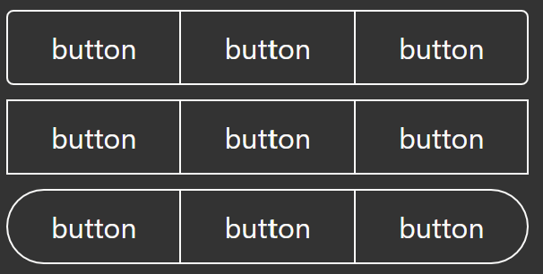
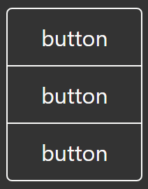

# Button Group

Used to group a few buttons together. Properties:

`variant`  
All buttons in the group will have this variant.

`radius`

The whole group will have this radius.

`clearButtonHover`  
Hover variant for clear button groups.

`primaryColor`  
Primary color for the buttons.

`secondaryColor`  
Secondary color, used as primary in dark mode.

`contrasting`  
If primary and secondary colors should switch in dark mode. Default is `true`.

`separator`  
Set to `false` to remove the separator between buttons. Default is `true`.

`vertical`

Switch to a vertical group
