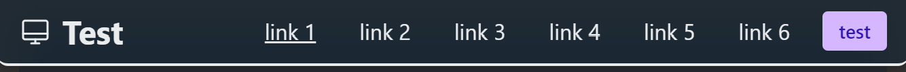
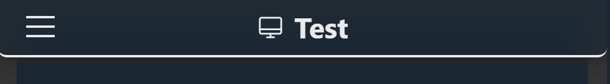
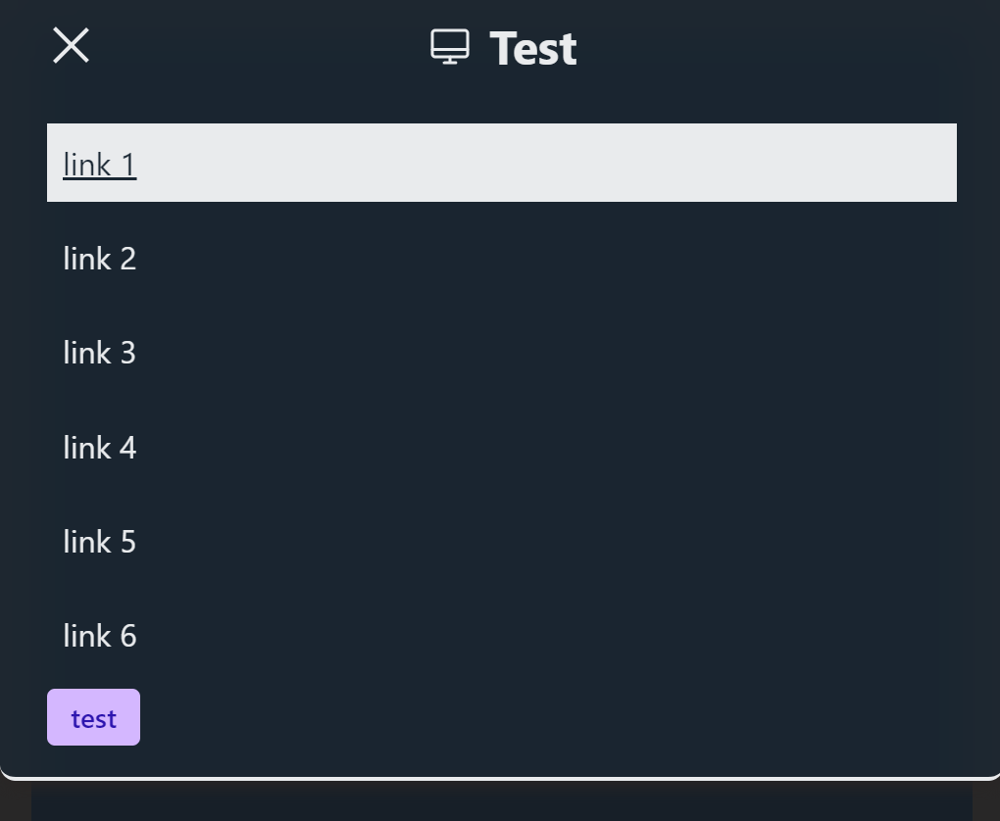

# Navbar

Extended:  

Collapsed:  

Open:  

The navbar is built using some components that will be mentioned below. It has the following properties:

`color`  
By default it uses the `main` color, but any color can be set.

`hasShadow`  
Adds a small shadow below the navbar, to create a hovering feeling.

`hasBorder`  
Adds a 2px border on the bottom (or top, if the navbar is bottom positioned).

`radius`  
Specifies the edge radius. Takes the theme setting into consideration if none is set.

`collapseAt`  
The navbar is responsive. So if you have a Navbar Collapse component inside it, it will be hidden on mobile devices and show again on big screens. Use this property to select at which size between the tailwind `sm`, `md`, `lg` and `xl` it should collapse.

`fixed`  
Boolean to indicate if the navbar should be fixed or be a part of the dom. Keep in mind that `fixed` uses an absolute position, so it will appear over other elements and you should compensate for it with a margin.

`position`  
if the navbar is fixed, you can choose the position to be `top` or `bottom`.

`glass`  
Adds a slightly transparent glass effect. Basically adds the `.glass` custom utility, that you an use on any other component.

`backdropClasses`  
There is a transparent backdrop behind the open nav menu for small screens. If you want to style that backdrop, like making it darker for example, you can add those classes here.

# Navbar components

The navbar creates a Navbar Context and you should use the following components inside the main Navbar Component, because they require the context.

## Navbar Brand

Use this component to add a brand logo and brand name to your navbar.

## Navbar Collapse

Add your navigation links here. You can add more things like text or buttons too. Anything you add here will be hidden on small screens and show on large ones.

## Navbar Link

Link with already applied styles for collapsed and not collapsed variants, but you can use your own `Anchor` components and style them accordingly

## Nabvar Toggle

This is the hamburger button for toggling between open and closed state of the nav menu.
